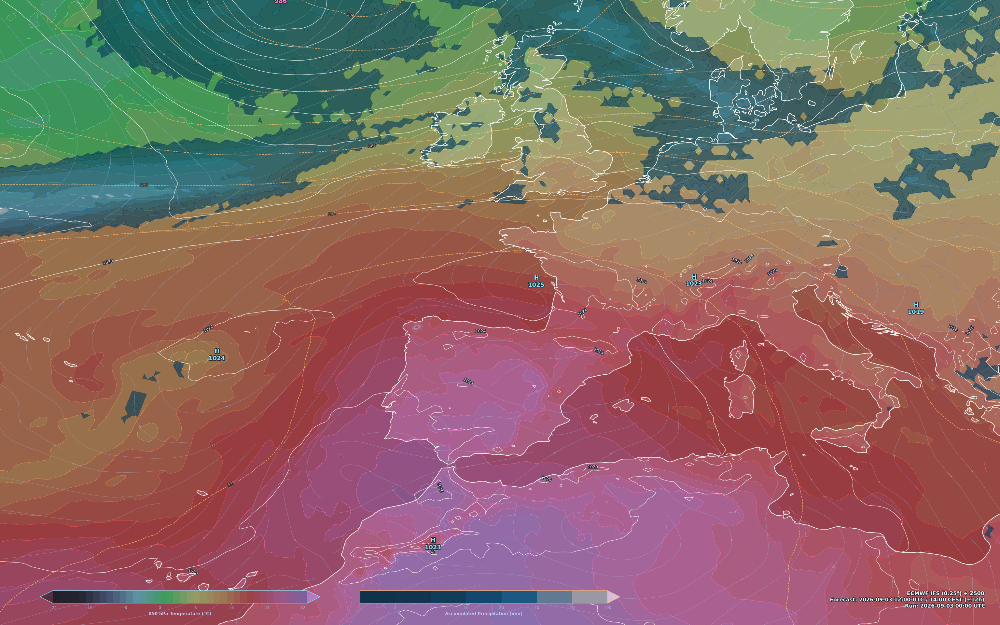

# 🌤️ WeatherWallpaper (ECMWF IFS Synoptic Desktop Background)

**WeatherWallpaper** is an automated wallpaper generator for Linux (Ubuntu / GNOME) that periodically retrieves operational numerical weather prediction data from the **ECMWF IFS Open Data** portal (0.25° resolution) and renders a high-definition synoptic desktop wallpaper tailored dynamically to your display's resolution, styled with a **Tokyo Night** aesthetic.



---

## 🎨 Features

- **ECMWF IFS Operational Open Data (0.25°)**: Downloads free operational weather forecast datasets from ECMWF via high-speed cloud mirrors (Azure/AWS).
- **Dynamic Future Forecast Step**: Automatically computes and selects the nearest future forecast step (+6h, +12h, etc.) based on the latest published model run.
- **Dynamic Screen Resolution**: Detects display resolution on the fly across X11, Wayland, GNOME, or DRM sysfs (e.g. `3072x1920`, `3840x2160`, `1920x1080`).
- **Synoptic Weather Layers**:
  1. **850 hPa Temperature (T850)**: Smooth continuous gradient with a custom vibrant *Tokyo Night* colormap.
  2. **Accumulated Precipitation (TP)**: Translucent electric-blue contours for rainfall > 1 mm.
  3. **Mean Sea Level Pressure (MSLP)**: High-definition white isobars spaced every 4 hPa.
  4. **High (H) and Low (L) Pressure Centers**: Automatically located and labeled with local pressure values.
  5. **500 hPa Geopotential Height (Z500)**: Orange dashed isohypses in decameters geopotential (gpdm).
  6. **10m Wind Streamlines**: Surface wind direction vectors.
- **Dotfile Configuration**: Easily customize map center coordinates and extent in `~/.weatherwallpaper.conf`.
- **Systemd User Timer**: Background service and timer updating the wallpaper automatically every 3 hours.

---

## ⚙️ Prerequisites & System Requirements

- **Operating System**: Linux (Ubuntu 22.04 / 24.04 / 26.04 or any GNOME-based distribution).
- **Package Manager**: [`uv`](https://github.com/astral-sh/uv).
- **Python Dependencies**: `ecmwf-opendata`, `xarray`, `cfgrib`, `eccodes`, `matplotlib`, `cartopy`, `scipy`, `pandas`.

---

## 🚀 Quick Start & Installation

1. **Clone the repository**:
   ```bash
   git clone https://github.com/bitic/weatherwallpaper.git
   cd weatherwallpaper
   ```

2. **Run the installation script**:
   ```bash
   chmod +x install.sh
   ./install.sh
   ```

The script sets up a virtual environment managed with `uv`, installs all required dependencies, renders the initial wallpaper, and activates the `systemd` user timer for background updates.

---

## 🎛️ Configuration (`~/.weatherwallpaper.conf`)

On the first run, a default configuration dotfile is generated at `~/.weatherwallpaper.conf`. You can customize the geographic center coordinates and extent:

```ini
# Weather Wallpaper Configuration
[MAP]
central_longitude = 5.0
central_latitude = 42.0
min_longitude = -25.0
max_longitude = 20.0
min_latitude = 28.0
max_latitude = 58.0
show_z500 = True
```

---

## 🛠️ Systemd Automation Management

Check and control the background updating service:

```bash
# Check timer status
systemctl --user status synoptic-bg.timer

# Force an immediate manual wallpaper update
systemctl --user start synoptic-bg.service

# View live service logs
journalctl --user -u synoptic-bg.service -f
```

---

## 📁 Repository Structure

```text
weatherwallpaper/
├── assets/
│   └── preview.png        # Sample wallpaper preview for documentation
├── generate_wallpaper.py  # Main Python script for data retrieval and map rendering
├── install.sh             # Setup script for dependencies and systemd integration
├── pyproject.toml         # Python project configuration and dependency list
├── systemd/
│   ├── synoptic-bg.service  # Systemd user service unit
│   └── synoptic-bg.timer    # Systemd user timer unit (3h execution interval)
├── .gitignore             # Git exclusion rules
├── LICENSE                # MIT License
└── README.md              # Project documentation
```

---

## 📄 License

This project is open-source and licensed under the **MIT License** - see the [LICENSE](LICENSE) file for details.
